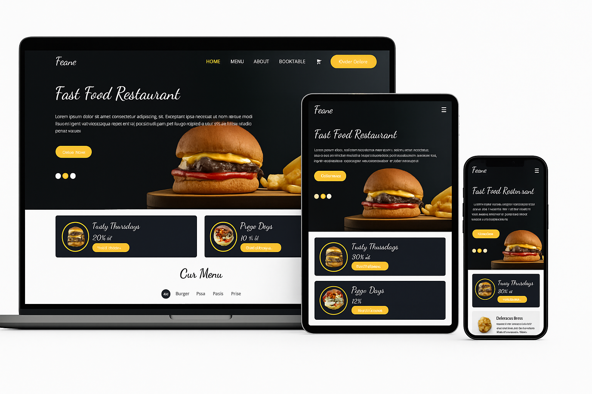

# Feane – Fast Food Restaurant 🍔

Uma interface moderna e totalmente responsiva para um restaurante fast-food, desenvolvida com foco em desempenho, escalabilidade e uma experiência de usuário fluida.

Este projeto demonstra a construção de um site profissional utilizando tecnologias atuais do ecossistema Front-End, combinando **velocidade, tipagem, animações suaves e design responsivo**.

# 🖥️ Preview do Projeto

Demonstração visual do layout em notebook, tablet e smartphone.



# 🚀 Tecnologias Utilizadas

## 🔥 Vite + React

Ambiente extremamente rápido para desenvolvimento.

Build otimizado.

Suporte ESModules nativo.

React para criação de componentes reutilizáveis e declarativos.

## 🧠 TypeScript

Tipagem estática para maior confiabilidade.

Redução de erros em tempo de desenvolvimento.

Melhora a manutenção e escalabilidade do projeto.

## 🎨 TailwindCSS

Estilização baseada em classes utilitárias.

Produtividade alta na construção de layouts.

Design responsivo com breakpoints claros.

Customização rápida e eficiente.

## ✨ Framer Motion

Animações suaves e fluidas.

Controle fino de transições.

Ótimo para banners, modais e movimentos do layout.

## 🎠 Swiper.js

Carrossel moderno e completamente responsivo.

Suporte a swipe, navegação, autoplay e paginação.

Perfeito para seções dinâmicas como banners e destaques.

## 📱 Responsividade

Este projeto foi construído com foco total em responsividade:

Mobile First

Layouts fluindo naturalmente entre celulares, tablets e desktops

Grid e Flex bem aplicados

Imagens otimizadas para qualquer dispositivo

## 📁 Como rodar o projeto localmente

Instale as dependências
```bash
#Escolha um desses comandos e intale no terminal do seu vscode

yarn install 
npm install

```
# Rode o projeto
```bash
 #No terminal do seu vscode rode um desses comandos    abaixo

yarn dev
   ou
npm run dev

```


# Acesse em: http://localhost:5173

# 🌐 Deploy

Este projeto foi preparado para deploy na Vercel, que realiza automaticamente:

Build do Vite

Otimização dos assets

Publicação contínua via GitHub

## 🧩 Estrutura do Projeto

📦 src
┣ 📂 assets
┣ 📂 components
┣ 📂 pages
┣ 📂 hooks
┣ 📂 styles
┗ main.tsx


## 🙌 Créditos e Contatos

<h1 align="center">
    
</h1>
 <p align="center"style="font-size: 12px; font-weight: lighter; color: white;">© - eriston.dev - <br>
    Desenvolvedor Fullstack (Front-end & Back-end)</p>

### 🌍 Redes e Portfólios**

Clique nos ícones abaixo para acessar:
<div style="display: flex; gap: 12px; align-items: center">

<a href="https://github.com/eristonDev">
  
</a>

<a href="https://wa.me/+5581997724095">
  
</a>

<a href="https://www.linkedin.com/in/eriston-m-b8b705284/">
  
</a>

<a href="https://vercel.com/eristons-projects/fast-food-cc86">
  <svg width="40" height="40" viewBox="0 0 116 100" fill="white" xmlns="http://www.w3.org/2000/svg">
    <path d="M58 0L116 100H0L58 0Z"/>
  </svg>
</a>


</div>


